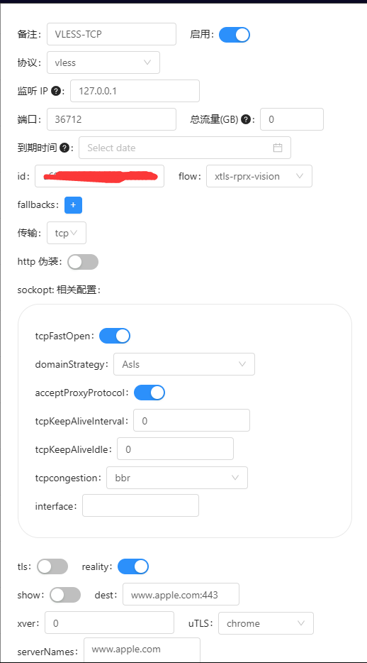
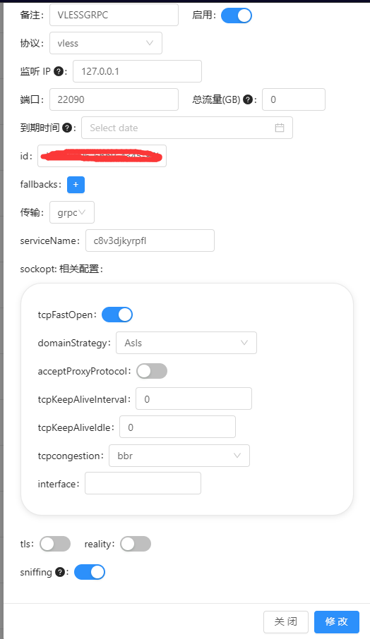

# Nginx前置SNI分流

xray-ui 面板配置

面板配置示例：

## 说明：Nginx前置SNI分流 没做nginx 代理时必须打开sockopt 下面的acceptProxyProtocol 如果使用nginx 转发过例如 grpc ws  不需要开启acceptProxyProtocol

## reality 配置 dest serverNames 每个配置不能重复别使用www.bing.com这个域名




## nginx 配置

nginx.conf

```nginx
user nginx;
worker_processes auto;
worker_priority 1;
worker_shutdown_timeout 10s;
error_log /var/log/nginx/error.log notice;
pid /var/run/nginx.pid;

events {
    worker_connections 1024;
    multi_accept on;
    use epoll;
}

http {
    log_format main '[$time_local] $proxy_protocol_addr "$http_referer" "$http_user_agent"';
    access_log /var/log/nginx/access.log main;

    map $http_upgrade $connection_upgrade {
        default upgrade;
        ""      close;
    }

    map $proxy_protocol_addr $proxy_forwarded_elem {
        ~^[0-9.]+$        "for=$proxy_protocol_addr";
        ~^[0-9A-Fa-f:.]+$ "for=\"[$proxy_protocol_addr]\"";
        default           "for=unknown";
    }

    map $http_forwarded $proxy_add_forwarded {
        "~^(,[ \\t]*)*([!#$%&'*+.^_`|~0-9A-Za-z-]+=([!#$%&'*+.^_`|~0-9A-Za-z-]+|\"([\\t \\x21\\x23-\\x5B\\x5D-\\x7E\\x80-\\xFF]|\\\\[\\t \\x21-\\x7E\\x80-\\xFF])*\"))?(;([!#$%&'*+.^_`|~0-9A-Za-z-]+=([!#$%&'*+.^_`|~0-9A-Za-z-]+|\"([\\t \\x21\\x23-\\x5B\\x5D-\\x7E\\x80-\\xFF]|\\\\[\\t \\x21-\\x7E\\x80-\\xFF])*\"))?)*([ \\t]*,([ \\t]*([!#$%&'*+.^_`|~0-9A-Za-z-]+=([!#$%&'*+.^_`|~0-9A-Za-z-]+|\"([\\t \\x21\\x23-\\x5B\\x5D-\\x7E\\x80-\\xFF]|\\\\[\\t \\x21-\\x7E\\x80-\\xFF])*\"))?(;([!#$%&'*+.^_`|~0-9A-Za-z-]+=([!#$%&'*+.^_`|~0-9A-Za-z-]+|\"([\\t \\x21\\x23-\\x5B\\x5D-\\x7E\\x80-\\xFF]|\\\\[\\t \\x21-\\x7E\\x80-\\xFF])*\"))?)*)?)*$" "$http_forwarded, $proxy_forwarded_elem";
        default "$proxy_forwarded_elem";
    }

 include /etc/nginx/conf.d/*.conf;   
}

stream {
    log_format basic '$remote_addr [$time_local] '
                 '$protocol $status $bytes_sent $bytes_received '
                 '$session_time $ssl_preread_server_name';
    access_log /var/log/nginx/stream-access.log basic buffer=32k;
    include /etc/nginx/conf.d/*.stream;
}

```

vless+grpc+sni 配置

```nginx
cd /etc/nginx/conf.d 

# vlessgrpc.conf 文件内容
server {
    listen 80;
    server_name example.com;
    root /usr/share/nginx/html;
    index index.php index.html index.htm;
    location / {
        root /usr/share/nginx/html;
        index index.php index.html index.htm;
    }
}

server {

	listen 127.0.0.1:443 ssl http2 proxy_protocol;
    set_real_ip_from 127.0.0.1;
    real_ip_header proxy_protocol;
	server_name example.com;

	index index.html;
	root /var/www/html;

	ssl_certificate /path/to/example.cer;
	ssl_certificate_key /path/to/example.key;
	ssl_protocols TLSv1.2 TLSv1.3;
	ssl_ciphers ECDHE-ECDSA-AES128-GCM-SHA256:ECDHE-RSA-AES128-GCM-SHA256:ECDHE-ECDSA-AES256-GCM-SHA384:ECDHE-RSA-AES256-GCM-SHA384:ECDHE-ECDSA-CHACHA20-POLY1305:ECDHE-RSA-CHACHA20-POLY1305:DHE-RSA-AES128-GCM-SHA256:DHE-RSA-AES256-GCM-SHA384;
	
	client_header_timeout 52w;
        keepalive_timeout 52w;
	# 在 location 后填写 /你的 ServiceName
	location /你的 ServiceName {
		if ($content_type !~ "application/grpc") {
			return 404;
		}
		client_max_body_size 0;
		client_body_buffer_size 512k;
		grpc_set_header X-Real-IP $remote_addr;
        grpc_set_header X-Forwarded-For $proxy_add_x_forwarded_for;
        client_body_timeout 52w;
		grpc_read_timeout 52w;
		grpc_pass grpc://127.0.0.1:22090;
	}
}

# 默认站点配置
# default.conf 文件内容
server {
    listen 80 default_server reuseport so_keepalive=on backlog=4096;
    server_name _;
    root /usr/share/nginx/html;
    index index.php index.html index.htm;
    location / {
        root /usr/share/nginx/html;
        index index.php index.html index.htm;
    }
}
server {
    listen 127.0.0.1:443 ssl http2 proxy_protocol reuseport default_server so_keepalive=on backlog=4096;
    set_real_ip_from 127.0.0.1;
    real_ip_header proxy_protocol;
    server_name _;
	index index.html;
	root /var/www/html;

	ssl_certificate /path/to/example.cer;
	ssl_certificate_key /path/to/example.key;
	ssl_protocols TLSv1.2 TLSv1.3;
	ssl_ciphers ECDHE-ECDSA-AES128-GCM-SHA256:ECDHE-RSA-AES128-GCM-SHA256:ECDHE-ECDSA-AES256-GCM-SHA384:ECDHE-RSA-AES256-GCM-SHA384:ECDHE-ECDSA-CHACHA20-POLY1305:ECDHE-RSA-CHACHA20-POLY1305:DHE-RSA-AES128-GCM-SHA256:DHE-RSA-AES256-GCM-SHA384;
    access_log off;
    proxy_ssl_server_name on;
    location / {
        root /usr/share/nginx/html;
        index index.php index.html index.htm;
    }
}
```

sni 分流配置

```nginx
# default.stream 文件内容
map $ssl_preread_server_name $stream_map {
    example.com web; # vless+grpc+sni 配置
    www.apple.com vlesstcpreality; # vless+xtls+tcp+reality+sni配置 reality 配置 dest serverNames 每个配置不能重复别使用www.bing.com这个域名
    default web; # 默认转发
}

upstream web {
    server 127.0.0.1:443;
}


upstream vlesstcpreality {
    server 127.0.0.1:36712;
}

server {
    listen [服务器公网IP]:443 reuseport so_keepalive=on backlog=4096;
    proxy_pass $stream_map;
    ssl_preread on;
    proxy_protocol on;
}

```